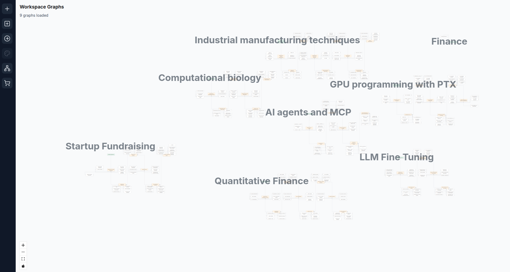
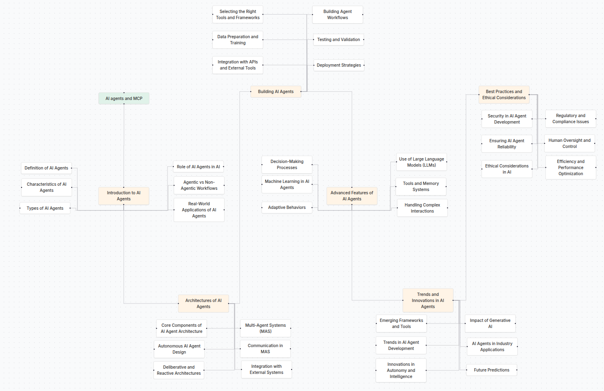
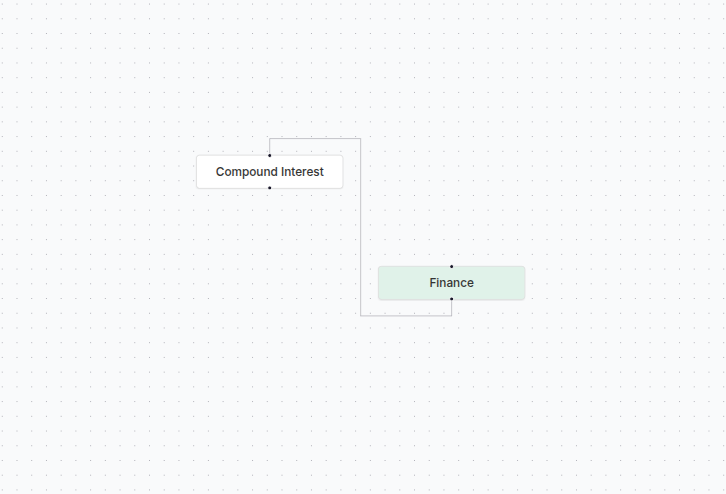
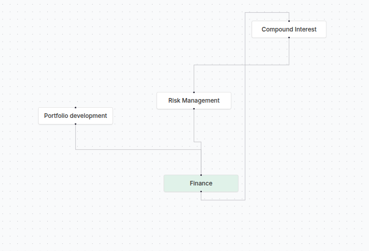
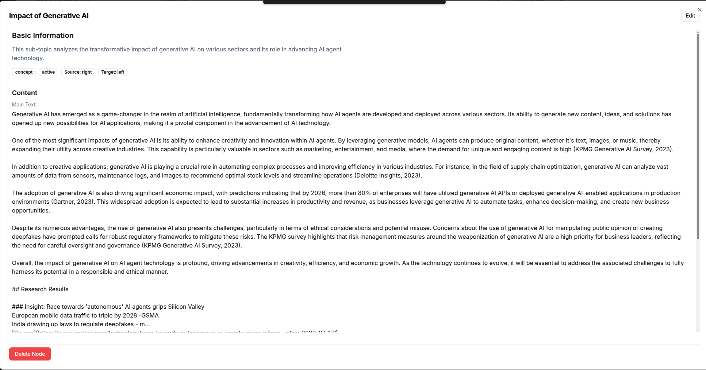
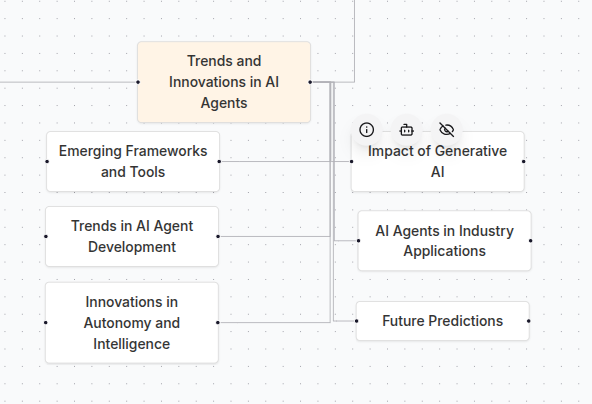

# BrainUniverse

This project was built in under 2 weeks as part of the GauntletAI program



BrainUniverse is an interactive, AI-powered knowledge repository and exploration platform designed to help students visualize and track their learning progress, explore new ideas, and build meaningful connections between subjects.

## 🌌 Overview

BrainUniverse structures knowledge in a dynamic, mind-map format where users start with a central idea and expand outward into related topics. 

AI deep-research generated lessons ensure efficient, engaging learning while guiding users through personalized learning paths.

## ✨ Key Features

### 🚀 Automated Roadmap Generation

Generate personalized learning paths based on your interests and goals. The AI analyzes your current knowledge and suggests the most relevant next steps.



### 📊 Flexible Graph Creation

Create and customize your own knowledge graphs with an intuitive interface. Add nodes, connect concepts, and organize your learning journey.




### 🔍 Deep Research

Access AI-powered deep research for any concept. Get comprehensive information, explanations, and related resources to enhance your understanding.



### 📝 Node Management

Easily manage your knowledge nodes with a powerful context menu. Edit, connect, delete, or research nodes with just a few clicks.



## 🛠️ Technology Stack

BrainUniverse is built with modern web technologies:

- **Frontend**: Next.js, React, TypeScript, Tailwind CSS
- **State Management**: Zustand, React Flow
- **UI Components**: Shadcn UI, Radix UI
- **Backend**: Firebase (Authentication, Firestore, Cloud Functions)
- **AI Integration**: LangChain, OpenAI, Anthropic

## 🚀 Getting Started

### Prerequisites

- Node.js 18.x or higher
- npm or yarn
- Firebase account

### Installation

1. Clone the repository:
```bash
git clone https://github.com/yourusername/brainuniverse.git
cd brainuniverse
```

2. Install dependencies:
```bash
npm install
# or
yarn install
```

3. Set up environment variables:
Create a `.env.local` file in the root directory with your Firebase and AI provider credentials.

4. Run the development server:
```bash
npm run dev
# or
yarn dev
```

5. Open [http://localhost:3000](http://localhost:3000) with your browser to see the result.

## 🔒 Authentication

BrainUniverse uses Firebase Authentication for user management. Users can sign up, sign in, and manage their profiles securely.

## 📊 Database Structure

The project uses Firebase Firestore with the following structure:

```
users
  └─ {userId} (doc) // User profile
        └─ graphs (subcollection)
            └─ {graphId} (doc) // Graph profile
                ├─ nodes (subcollection)
                └─ edges (subcollection)

templates
    └─ {template_source_name} (subcollection) // Template source
        └─ {subject} (subcollection) // e.g. Math
                └─ {graphId} (doc) // Graph profile
                    ├─ nodes (subcollection)
                    └─ edges (subcollection)
```

## �� Acknowledgements

- [Next.js](https://nextjs.org/)
- [React Flow](https://reactflow.dev/)
- [Firebase](https://firebase.google.com/)
- [Shadcn UI](https://ui.shadcn.com/)
- [LangChain](https://js.langchain.com/)
